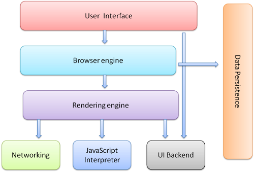
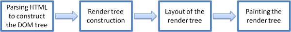
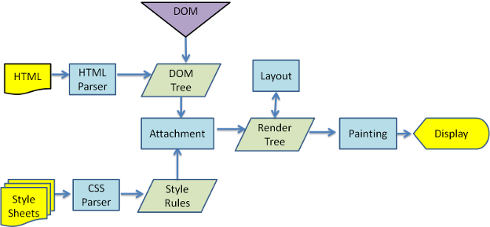
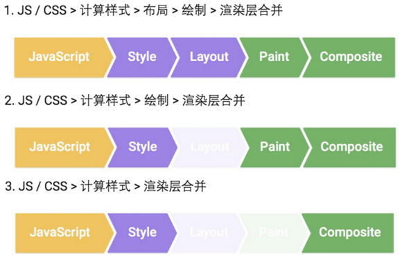
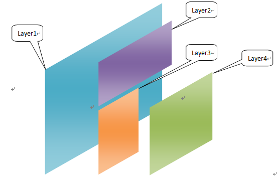
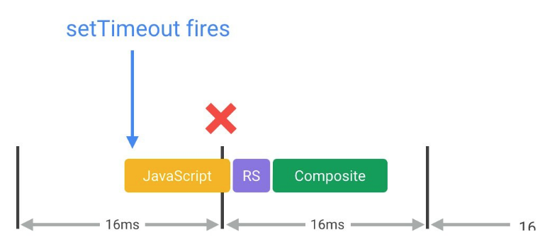
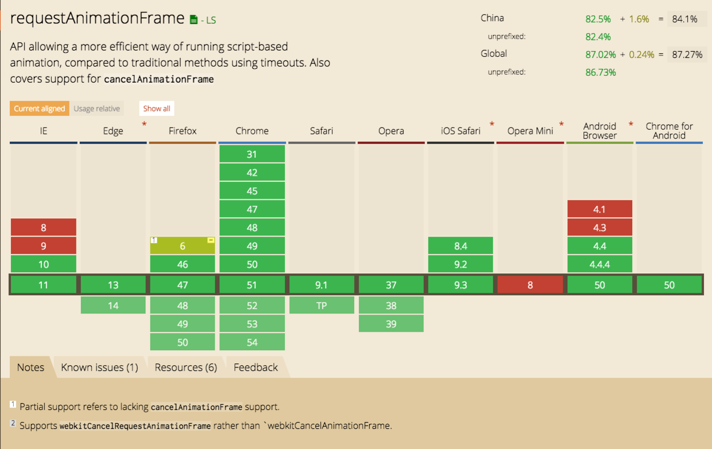
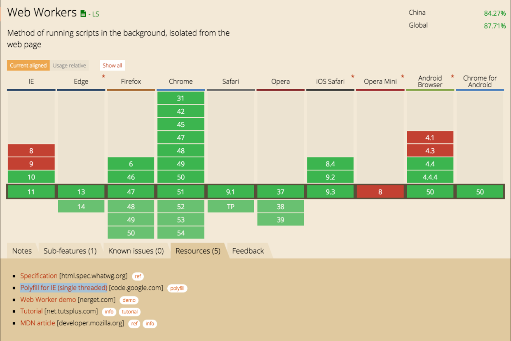
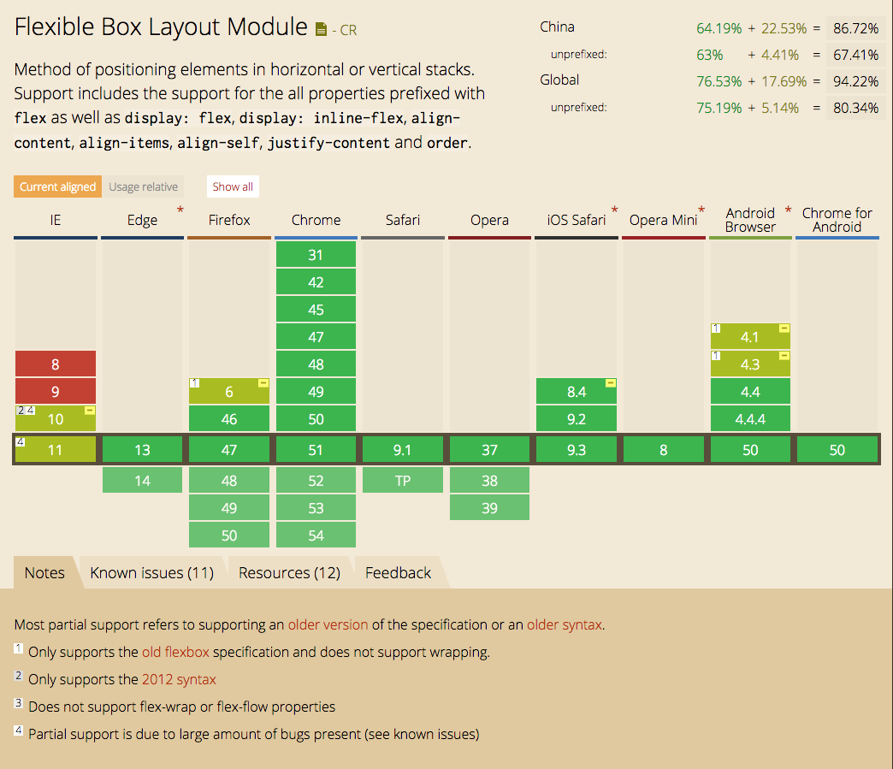

# 居于浏览器渲染原理的动画优化方式

## 1、 各大浏览器的内核。

* Google Chrome: 之前内核是webkit，现在是blink；
* Mozilla Firfox :Gecko;
* Opera: blink;
* Safari: webkit;
* IE: Trident;
* 360安全浏览器：IE内核；
* 360极速浏览器：Chromium和IE内核；
* QQ浏览器：普通模式-Trident，极速模式-webkit;

## 2、浏览器的组件。
* 用户界面 － 包括地址栏、后退/前进按钮、书签目录等，也就是你所看到的除了用来显示你所请求页面的主窗口之外的其他部分。
* 浏览器引擎 － 用来查询及操作渲染引擎的接口。
* 渲染引擎 － 用来显示请求的内容，例如，如果请求内容为html，它负责解析html及css，并将解析后的结果显示出来。
* 网络 － 用来完成网络调用，例如http请求，它具有平台无关的接口，可以在不同平台上工作。
* UI后端 － 用来绘制类似组合选择框及对话框等基本组件，具有不特定于某个平台的通用接口，底层使用操作系统的用户接口。
* JS解释器 － 用来解释执行JS代码。
* 数据存储 － 属于持久层，浏览器需要在硬盘中保存类似cookie的各种数据，HTML5定义了web database技术，这是一种轻量级完整的客户端存储技术



## 3、渲染引擎（Rendering Engine）
> 渲染引擎可是现实html、xml、图片以及借助一些插件显示其他内容，例如pdf插件。

### [1]页面渲染主要流程（MainFlow）


#### 大致过程
> 解析Dom Tree -----> 构建Render Tree -----> 布局Render Tree -----> 绘制Render Tree

#### 详细过程：
* 下载文档后开始解析html，形成Dom Tree，也就是以树形结构的形式来将各个标签转化成树上的节点（node）。
* 然后解析外部的css文件以及内联样式，将CSS解析成树形的数据结构Css Rule Tree（style rules）。
* DOM和CSSOM（Css Rule Tree）合并后生成Render Tree。
* layout：有了Render Tree，浏览器就知道了网页中有哪些node、以及各个node的关系以及css定义，就可以计算出每个node在屏幕上的位置。
* Painting，即根据计算出来的规则，通过显卡将内容显示到屏幕上。

> 下图为webkit的渲染流程：
>  

### [2]动画渲染流程
* JavaScript：JavaScript实现动画效果，DOM元素操作等。
* Style（计算样式）：确定每个DOM元素应该应用什么CSS规则。
* Layout（布局）：计算每个DOM元素在最终屏幕上显示的大小和位置。由于web页面的元素布局是相对的，所以其中任意一个元素的位置发生变化，都会联动的引起其他元素发生变化，这个过程叫reflow。
* Paint（绘制）：在多个层上绘制DOM元素的的文字、颜色、图像、边框和阴影等。
* Composite（渲染层合并）：按照合理的顺序合并图层然后显示到屏幕上。

> 以下是常见的动画渲染过程：
> 


## 4、Reflow（回流）/Repaint（重绘）
* reflow：浏览器在得知元素发生了样式变化，并且对Dom Tree的排版有影响时，就会对所有受到影响的dom node进行重新的排版。例如：width、height、margin、padding、border-width等。
* repaint：浏览器在得知元素发生了样式变化，并且对Dom Tree的排版没有影响时，就会对该元素进行重绘。例如：color、background-color等不影响盒子形状的属性。

## 5、compositor layer（合成渲染层）
> 一个网页通常可以包含很多层，如下所示：
> 
> 对于transform/opacity 这两种变换，浏览器不会用repaint/reflow处理，而是在已经渲染好的元素基础上进行附加工作。例如一个黑底色的div,往右飞100px, 传统JS过程是对每次修改left值后重新画一个div。而如果我们用transform:translate(0,100px) ,transition:2s 浏览器则是把这个绘制好的div单独放在一个画面层再平移这个层过去，div的几何形状，颜色不会再重复计算，而是保留在这个图层中。
> 可以通过3d变化的元素，来集中显卡资源渲染动画，例如：translate3d、translateZ，这样能使得动画更平滑。

## 6、（动画）渲染卡顿、缓慢的优化
> 大多数设备的刷新频率是60次/秒，也就说是浏览器对每一帧画面的渲染工作要在16ms内完成，超出这个时间，页面的渲染就会出现卡顿现象，影响用户体验。
> 结合上述的渲染流程，我们可以去针对性的分析并优化每个步骤。

### [1] 优化JavaScript的执行效率

#### 尽量使用requestAnimationFrame，避免setInternal、setTimeout

> 动画实现，避免使用setTimeout或setInterval，尽量使用requestAnimationFrame
>  setTimeout(callback)和setInterval(callback)无法保证callback函数的执行时机，很可能在帧结束的时候执行，从而导致丢帧，如下图：



> requestAnimationFrame(callback)可以保证callback函数在每帧动画开始的时候执行。
>> jQuery的animate函数就是用setTimeout来实现动画，可以通过jquery-requestAnimationFrame这个补丁来用requestAnimationFrame替代setTimeout。
```
    // requestAnimationFrame将保证updateScreen函数在每帧的开始运行
    requestAnimationFrame(updateScreen);
``

> 下图是requestAnimationFrame的兼容性：
> 

#### 利用webSocket来运行耗时很长的js代码
> JavaScript代码运行在浏览器的主线程上，与此同时，浏览器的主线程还负责样式计算、布局、绘制的工作，如果JavaScript代码运行时间过长，就会阻塞其他渲染工作，很可能会导致丢帧。
> 大多数设备的刷新频率是60次/秒，也就说是浏览器对每一帧画面的渲染工作要在16ms内完成，超出这个时间，页面的渲染就会出现卡顿现象，影响用户体验。
> 但在动画过程中，由于已经被占用了不少时间，所以JavaScript代码运行耗时应该控制在3-4毫秒。
> 如果真的有特别耗时且不操作DOM元素的纯计算工作，可以考虑放到Web Workers中执行。
```
    var dataSortWorker = new Worker("sort-worker.js");

    dataSortWorker.postMesssage(dataToSort);

    // 主线程不受Web Workers线程干扰
    dataSortWorker.addEventListener('message', function(evt) {
        var sortedData = e.data;

        // Web Workers线程执行结束
        // ...
    });
```

> 下图是webSocket的兼容性：

> 

#### 把DOM元素的更新划分为多个小任务，分别在多个frame中去完成

> webSocket是有限制的，不能操作DOM，只能执行纯计算类工作。如果需要操作DOM，可以切分为几个任务小块，每个任务都作为requestAnimationFrame的callback来执行。
```
     var taskList = breakBigTaskIntoMicroTasks(monsterTaskList);
     requestAnimationFrame(processTaskList);
     function processTaskList(taskStartTime) {
        var nextTask = taskList.pop();
        // 执行小任务
        processTask(nextTask);
        if (taskList.length > 0) {
            requestAnimationFrame(processTaskList);
        }
     }
```

#### 打开Chrome DevTools > Timeline > JS Profile，录制一次动作，然后分析得到的细节信息，从而发现问题并修复问题。

### [2] 降低样式计算的范围、复杂度
> 增删DOM元素，改动元素的几何属性、应用效果，都会引起DOM的改变，导致reflow，即重新计算样式规则。
> 样式计算主要分为两步：
>> * 创建一套匹配的样式选择器
>> * 为匹配的样式选择器计算具体的样式规则。

#### 尽量保持class的简短，或使用Web Components框架。
```
    .box:nth-last-child(-n+1) .title {
    }
    // 改善后
    .final-box-title {
    }
```

#### 减少需要执行样式计算的元素个数
> 现代浏览器是对目标元素执行样式计算的，而不是针对整个页面，所以要尽可能减少需要计算样式的元素个数。

### [3] 避免大规模、复杂的布局
> 布局就是计算DOM元素的大小和位置的过程，如果你的页面中包含很多元素，那么计算这些元素的位置将耗费很长时间。
> 布局的主要消耗在于：
>> * 需要布局的DOM元素的数量；
>> * 布局过程的复杂程度

#### 尽可能不触发布局
> 尽可能避免触发布局(即尽量避免操于DOM元素的“几何属性”：width/height/left/top)，可以使用Chrome DevTools工具的Timeline查看布局明细。

#### 使用flexbox替代老的布局模型。
> 老布局：相对/绝对/浮动，flexbox：流式布局。
> 下图是flexbox布局的兼容性

> 

#### 避免强制同步布局
> 强制同步布局：可以强制浏览器在执行JavaScript脚本之前先执行布局过程（参见动画渲染流程图）。
```
    requestAnimationFrame(logBoxHeight);
    // 先写后读，触发强制布局
    function logBoxHeight() {
        // 更新box样式
        box.classList.add('super-big');

        // 为了返回box的offersetHeight值
        // 浏览器必须先应用属性修改，接着执行布局过程
        console.log(box.offsetHeight);
    }
    // 先读后写，避免强制布局
    function logBoxHeight() {
        // 获取box.offsetHeight
        console.log(box.offsetHeight);

        // 更新box样式
        box.classList.add('super-big');
    }
```
> 在JavaScript脚本运行的时候，它能获取到的元素样式属性值都是上一帧画面的，都是旧的值。因此，如果你在当前帧获取属性之前又对元素节点有改动，那就会导致浏览器必须先应用属性修改，结果执行布局过程，最后再执行JavaScript逻辑。

#### 千万不要连续的触发强制同步布局
> 连续的触发强制同步布局，那么结果更糟糕。
> 比如下面的例子，获取box的属性，设置到paragraphs上，由于每次设置paragraphs都会触发样式计算和布局过程，而下一次获取box的属性必须等到上一步设置结束之后才能触发。
```
    function resizeWidth() {`
        // 会让浏览器陷入'读写读写'循环
        for (var i = 0; i < paragraphs.length; i++) {
            paragraphs[i].style.width = box.offsetWidth + 'px';
        }
    }
    // 改善后方案
    var width = box.offsetWidth;
    function resizeWidth() {
        for (var i = 0; i < paragraphs.length; i++) {
            paragraphs[i].style.width = width + 'px';
        }
    }
```

### [4] 简化绘制的复杂度、减少绘制区域
> 通常绘制是整个渲染流程中耗时最长的一环，因此是需要尽可能的避免重复发生这一环。
> Layout被触发，元素的Paint一定会被触发。只是改变元素的非几何属性（背景、文字颜色、阴影效果），也可能会触发Paint。

#### 提升移动或渐变元素的绘制层
> 绘制并非总是在内存中的单层画面里完成的，实际上，浏览器在必要时会将一帧画面绘制成多层画面，然后将这若干层画面合并成一张图片显示到屏幕上。
> 这种绘制方式的好处是，使用transform来实现移动效果的元素将会被正常绘制，同时不会触发其他元素的绘制。

#### 减少绘制区域
> 浏览器会把相邻区域的渲染任务合并在一起进行，所以需要对动画效果进行精密设计，以保证各自的绘制区域不会有太多重叠。

### [5] 优先使用渲染层合并属性、控制层数量
#### 使用transform/opacity实现动画效果，会跳过渲染流程的布局和绘制环节，只做渲染层的合并。
> 会跳过渲染流程的布局和绘制环节，只做渲染层的合并。

#### 提升动画效果中的元素
> 在页面中创建一个新的渲染层最好的方式就是使用CSS属性winll-change，对于目前还不支持will-change属性、但支持创建渲染层的浏览器，可以通过3D transform属性来强制浏览器创建一个新的渲染层。需要注意的是，不要创建过多的渲染层，这意味着新的内存分配和更复杂的层管理。
```
    .moving-element {
         will-change: transform;
         transform: translateZ(0);
    }
```

> winll-change的兼容性：

> 


[点击查看：详细的渲染原理以及浏览器内部工作机制](http://www.cnblogs.com/yanglang/p/7090120.html)
[点击查看：如何减少reflow/repaint](http://blog.csdn.net/alex8046/article/details/43834453)